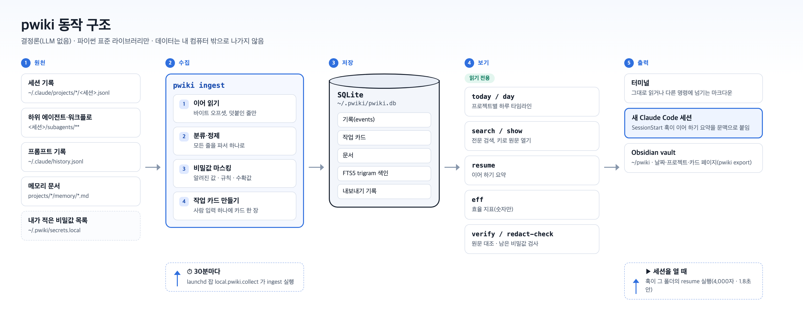

<div align="center">

# pwiki

**Claude Code 기록을 보존하고, 비밀값은 마스킹하고, 작업을 이어 줍니다. 내 컴퓨터 안에서, LLM 없이.**

30일 자동 삭제 뒤에도 보존 · 저장 전에 비밀값 마스킹 · `/clear` 뒤에도 맥락 복원


[English](README.md) · **한국어**

</div>

---

Claude Code 는 **30일이 지난 세션 기록을 영구 삭제합니다**(`cleanupPeriodDays`). 몇 주 전에 한 일을 찾으려면 JSONL 원문을 뒤져야 합니다.
pwiki 는 기록이 지워지기 전에 내 컴퓨터 안의 SQLite DB 하나로 옮기고, 저장하면서 비밀값을 마스킹하고, 새 세션을 열 때 지난 세션의 요점을 Claude Code 에 돌려줍니다.

- **보존**: Claude Code 가 30일 뒤 지운 기록도 그대로 검색됩니다.
- **마스킹**: 비밀번호·토큰 모양 값은 저장하기 전에 `[REDACTED:…]` 로 바뀝니다. [무엇을 마스킹하는지](docs/REDACTION.ko.md)
- **이어 하기**: `/clear` 뒤나 새 세션에서, SessionStart 훅이 마지막 요청·답·미완 할 일·그날 작업을 문맥으로 붙입니다.
- **찾기**: 사람 입력 단위의 하루 타임라인과 모든 세션 전문 검색.

LLM 을 부르지 않고, 네트워크를 쓰지 않고, 설치할 패키지도 없습니다(파이썬 표준 라이브러리만). 같은 기록이면 언제나 같은 결과가 나옵니다.


## Claude Code 안에서 쓰기

설치하고 나면 명령을 외울 필요가 없습니다. Claude Code 세션에서 그냥 물어보면 됩니다.

> 어제 뭐 했지?
> 지난주에 돌린 mysql 명령 찾아줘
> 이 프로젝트 어디까지 했더라?
> 실수로 세션을 닫았는데, 어느 세션이었는지 찾아줘

Claude 가 함께 설치되는 **스킬**로 알맞은 pwiki 명령을 골라 실행하고, 기록을 읽어 답합니다. 확실하게 부르고 싶으면 슬래시 명령을 씁니다.

| 입력 | 하는 일 |
|---|---|
| `/pwiki` | 오늘 한 일 요약 |
| `/pwiki 어제` 또는 `/pwiki 2026-10-02` | 그날 타임라인 |
| `/pwiki <낱말>` | 모든 세션에서 검색. 예: `/pwiki mysql` |
| `/pwiki resume` | 지금 프로젝트에서 어디까지 했는지 |

스킬은 pwiki 의 조회 명령(`today`, `day`, `search`, `show`, `resume`, `redact-check`)과 색인을 새로 고치는 `ingest --all` 만 미리 허용해서, 이 명령들은 권한 확인 창 없이 돕니다. 그 밖의 명령은 여전히 확인을 묻습니다. Claude Code 의 `!` 를 붙여 직접 실행할 수도 있습니다. 예: `! pwiki today`

## 동작 구조



1. **원천**: Claude Code 가 남긴 세션 기록, 하위 에이전트·워크플로 기록, 프롬프트 기록, 메모리 문서를 읽습니다.
2. **수집** (`pwiki ingest`): 지난번에 읽은 자리부터 새 줄만 이어 읽고, 분류하고, 비밀값을 가린 뒤, 사람 입력 하나마다 작업 카드 한 장을 만듭니다. DB 에 쓰는 것은 이 단계 하나뿐입니다.
3. **저장**: `~/.pwiki/pwiki.db` 에 기록·카드·문서와 FTS5 trigram 검색 색인을 둡니다.
4. **보기**: 타임라인·검색·이어 하기·지표·검사 명령은 모두 DB 를 읽기만 합니다.
5. **출력**: 터미널, 새 Claude Code 세션(이어 하기 훅), Obsidian vault 로 내보냅니다.

수집은 macOS launchd 잡이 30분마다 돌리고, 이어 하기 훅은 Claude Code 가 새 세션을 열 때 돕니다.

## 화면

> 아래 화면은 저장소에 든 합성 기록 생성기(`tools/make_fixture.py`)로 만든 가짜 데이터입니다. 출력 문구는 한국어입니다.

**하루 타임라인**: `pwiki day` 는 그날 사람 입력을 프로젝트·세션별 카드로 보여 줍니다. 입력마다 마지막 답의 앞부분이 붙습니다.


**이어 하기**: `pwiki resume` 은 마지막 요청과 답, 미완 할 일, 해결 안 된 에러, 그날 작업을 4,000자 안으로 모읍니다. 이어 하기 훅을 켜면 새 세션이 열릴 때 이 내용이 자동으로 붙습니다.


**검색과 마스킹**: `pwiki search` 는 한국어 어간까지 다루는 전문 검색입니다. 결과의 키를 `pwiki show` 에 주면 전문이 열립니다. 비밀번호와 토큰은 저장할 때 이미 마스킹되어 있습니다.


## 빠른 시작

```sh
git clone <저장소 주소> ~/src/pwiki && ~/src/pwiki/install.sh
```

설치기는 선택 단계(자동 수집, 이어 하기 훅, Claude Code 스킬)마다 묻습니다. 그다음 터미널에서:

```sh
alias pwiki='/usr/bin/python3 ~/src/pwiki/pwiki'
pwiki today
```

저장소는 `~/pwiki` 에 두지 않습니다. 그 자리는 vault 기본 위치입니다.

## pwiki 가 건드리는 곳

| 경로 | 하는 일 | 언제 |
|---|---|---|
| `~/.claude/projects`, `history.jsonl`, 메모리 파일 | **읽기만.** 고치거나 지우지 않음 | 수집할 때마다 |
| `~/.codex/sessions/**/rollout-*.jsonl`, `~/.codex/history.jsonl` | **읽기만.** `~/.codex` 의 다른 파일(`auth.json`, `config.toml` 등)은 열지 않음 | Codex CLI 가 있으면 수집할 때마다 |
| `~/.pwiki/` (권한 700) | DB, 로그, 내가 적은 비밀값 목록 | 설치, 수집할 때마다 |
| `~/pwiki/` | Obsidian 용 마크다운 페이지 | `pwiki export` |
| `~/Library/LaunchAgents/local.pwiki.collect.plist` | 30분마다 수집(macOS) | 설치 선택 단계 |
| `~/.claude/settings.json` | SessionStart 훅 그룹 하나 덧붙임. `./uninstall.sh` 가 뺌 | 설치 선택 단계 |
| `~/.claude/skills/pwiki/SKILL.md` | `/pwiki` 스킬. `./uninstall.sh` 가 지움(pwiki 가 쓰지 않은 파일은 덮지 않음) | 설치 선택 단계 |

pwiki 는 `CLAUDE.md` 를 쓰지 않고, 작업 폴더를 건드리지 않고, 네트워크에 연결하지 않습니다. 예외는 `pwiki update` 하나입니다. 이 명령은 처음 clone 한 저장소에 `git fetch` 를 실행합니다.

## 요구 사항

- macOS(우선) 또는 리눅스
- Python 3.9 이상, 표준 라이브러리만. 맥은 `/usr/bin/python3`(명령줄 도구)를 먼저 씁니다.
- SQLite 3.34 이상, FTS5 trigram 지원. **SQLite 는 따로 설치하지 않습니다.** pwiki 는 파이썬에 들어 있는 SQLite 를 씁니다.

설치기는 찾은 `python3` 를 하나씩 시험해 두 조건을 확인합니다. 맞는 것이 없으면 후보마다 이유를 알려 주고 멈추며, 이때는 아무것도 바꾸지 않습니다.

<details>
<summary><b>파이썬이나 SQLite 가 없거나 오래됐을 때</b></summary>

지금 가진 것 확인:

```sh
python3 -c "import sys, sqlite3; print(sys.version.split()[0], sqlite3.sqlite_version)"
```

| 상황 | 해결 |
|---|---|
| 맥에 `python3` 가 없음 | `xcode-select --install` (명령줄 도구에 파이썬 3.9 와 새 SQLite 가 들어 있음) |
| 리눅스에 `python3` 가 없음 | `sudo apt install python3` (Ubuntu 22.04 이상, Debian 12 이상이면 두 조건 모두 충족) |
| SQLite 가 3.34 보다 오래됨 (예: Ubuntu 20.04) | 새 파이썬을 받습니다. 예: [uv](https://docs.astral.sh/uv/) 로 `uv python install 3.12` 후 `./install.sh --python "$(uv python find 3.12)"` |
| 특정 파이썬을 쓰고 싶음 (Homebrew, pyenv) | `./install.sh --python /경로/python3` |
| 윈도 | 직접은 지원하지 않습니다. WSL 에서 리눅스 방법을 따릅니다(시험 안 함) |

</details>
- Claude Code 기록 폴더(`~/.claude/projects`). 다른 곳이면 `PWIKI_CLAUDE_DIR` 로 줍니다.

## 시간대

날짜와 하루 경계는 **기본 KST(UTC+9)** 입니다. `PWIKI_TZ` 로 바꿀 수 있습니다. DB 는 UTC 로 저장하므로 다시 만들 필요가 없고, vault 의 날짜 페이지는 `pwiki export` 를 돌릴 때의 시간대를 따릅니다.

| `PWIKI_TZ` | 표시 예 |
|---|---|
| 비움 또는 `KST` | `KST` (기본) |
| `local` | 시스템 시간대, 예: `PDT` |
| `UTC` | `UTC` |
| `+05:30`, `-08:00`, `UTC+9` | `UTC+05:30` |
| `America/Los_Angeles`, `Europe/Berlin` | `PDT`, `CEST` (서머타임 반영) |

알아보지 못하는 값이면 KST 로 둡니다. 이어 하기 훅에도 적용하려면 셸 프로필이나 `~/.claude/settings.json` 의 `env` 처럼 Claude Code 가 보는 곳에 둡니다.

## 명령

| 명령 | 하는 일 |
|---|---|
| `pwiki today` | 오늘 프로젝트별 카드 목록(`PWIKI_TZ`, 기본 KST) |
| `pwiki day 2026-10-01` | 그날 카드 목록 |
| `pwiki search "낱말" [--project P] [--since D] [--kind human] [--all]` | 전문 검색. 기본은 하위 에이전트·워크플로 기록을 빼고, `--all` 이면 넣습니다 |
| `pwiki show <키>` | search·resume·day 출력의 키 하나의 전문(가린 뒤 저장된 글) |
| `pwiki resume --project P` | 이어 하기 요약(4,000자 안) |
| `pwiki export [--vault DIR]` | Obsidian vault 로 내보내기. 사람이 고친 페이지는 덮지 않습니다 |
| `pwiki ingest --all` | 새 기록 이어 읽기(자동 수집이 30분마다 돌립니다) |
| `pwiki verify` | 원문 줄 수를 다시 세어 적재·제외와 맞는지 대조 |
| `pwiki redact-check` | DB·WAL·검색 색인·vault·로그에 남은 비밀값 개수(값은 출력하지 않습니다) |
| `pwiki rederive [--apply]` | 저장된 행에 지금 규칙(마스킹·분류·카드)을 다시 적용 |
| `pwiki eff` | 효율 지표(숫자만) |
| `pwiki update [--check]` | 새 판을 받고 설치 때 고른 선택을 다시 반영합니다. `--check` 는 확인만 합니다 |

자동 수집은 DB 만 갱신합니다. vault 는 `pwiki export` 를 돌릴 때 갱신됩니다.

<details>
<summary><b>프로젝트 이름 P 로 쓸 수 있는 것</b></summary>

- `pwiki today` 가 보여 주는 이름. 홈 아래 작업 폴더 경로의 `/`·`.` 을 `-` 로 바꾼 것입니다(`~/work/alpha-api` 면 `work-alpha-api`). 폴더 이름만(`alpha-api`) 주면 찾지 못합니다.
- 작업 폴더의 절대 경로(`/Users/me/work/alpha-api`). 하위 폴더 경로는 그 폴더를 작업 폴더로 쓴 세션 기록이 있을 때만 찾습니다. `~` 로 시작하는 경로는 찾지 못합니다.
- `~/.claude/projects` 안의 폴더 이름.

</details>

## 설치

저장소를 원하는 곳에 풀고 그 자리에서 돌립니다. 설치기는 파일을 다른 곳으로 복사하지 않고, 푼 자리의 절대 경로를 씁니다.

```sh
./install.sh            # 단계마다 묻는다
./install.sh --dry-run  # 바꾸는 명령만 보여 주고 바꾸지 않는다
./install.sh --yes      # 선택 단계를 모두 켠다
./install.sh --no-collector --no-hook --yes   # 수집·vault 만
```

| 단계 | 내용 |
|---|---|
| 1 | 요건 검사(python·SQLite FTS5 trigram·기록 폴더) |
| 2 | `~/.pwiki` 만들기(권한 700). `secrets.local` 이 없으면 주석만 든 파일을 만든다(권한 600) |
| 3 | 첫 수집 `pwiki ingest --all`. 기록이 많으면 몇 분 걸린다 |
| 4 | vault 내보내기 `pwiki export` |
| 5 | (선택) 자동 수집. 맥은 launchd 잡 `local.pwiki.collect` 를 30분마다 돌린다. 리눅스는 crontab 한 줄을 안내만 한다 |
| 6 | (선택) 이어 하기 훅. `~/.claude/settings.json` 의 `hooks.SessionStart` 끝에 그룹 하나를 덧붙인다 |
| 7 | (선택) Claude Code 스킬. `~/.claude/skills/pwiki/SKILL.md` 를 둬서 세션 안에서 `/pwiki` 나 말로 쓰게 한다 |

다시 돌려도 안전합니다. 수집은 이어 읽고, plist 는 같으면 그대로 두고, 훅은 이미 있으면 다시 넣지 않고, 스킬 파일은 같으면 그대로 둡니다.

옵션: `--collector`·`--no-collector`, `--hook`·`--no-hook`, `--skill`·`--no-skill`, `--yes`, `--dry-run`, `--python PATH`, `--settings PATH`.
위치는 환경변수 `PWIKI_HOME`(기본 `~/.pwiki`), `PWIKI_VAULT`(기본 `~/pwiki`), `PWIKI_CLAUDE_DIR`(기본 `~/.claude`)로 바꿉니다.

<details>
<summary><b>설치 위치 규칙</b></summary>

- **저장소를 `~/pwiki` 에 두지 않습니다.** 그 자리는 vault 기본 위치입니다.
- 설치한 뒤 저장소 폴더를 옮기면 옮기기 전 자리에서 `./uninstall.sh` 를 먼저 돌리고, 새 자리에서 `./install.sh` 를 다시 돌립니다.
- 데이터 자리(`PWIKI_HOME`·`PWIKI_VAULT`)가 저장소나 `~/.claude` 와 겹치면 설치기가 멈춥니다.
- 두 자리에 pwiki 가 아닌 파일이 이미 있어도 멈춥니다(기존 폴더나 Obsidian vault 에 섞지 않습니다). 빈 폴더(숨김 파일만 있어도 됨)나 새 하위 폴더를 줍니다.
- 설치기는 두 자리에 표시 파일(`.pwiki-home`·`.pwiki-vault`)을 둡니다. 표시 파일 이전에 설치한 자리는 이렇게 알아봅니다.
  - `PWIKI_HOME`: pwiki DB(`pwiki.db`, 표 구성까지 확인)가 있으면 pwiki 자리입니다. 곁에 사람이 둔 항목은 설치·제거 모두 건드리지 않습니다. DB 가 없으면 pwiki 가 만드는 이름만 있을 때만 받습니다.
  - vault: export 기록(DB)의 페이지가 기록된 내용 그대로 하나 이상 있으면 pwiki 자리입니다. `_notes/` 가 있다는 것만으로는 pwiki vault 로 보지 않습니다.

</details>

<details>
<summary><b>settings.json 덧붙이기가 지키는 것</b></summary>

- 기존 항목은 키 순서까지 그대로 두고 그룹 하나만 덧붙입니다. 출력에 기존 값을 싣지 않습니다.
- 쓰기 직전에 파일이 그사이 바뀌었으면 쓰지 않고 멈춥니다. 쓴 뒤 다시 읽어 검사하고, 어긋나면 원래 바이트로 되돌립니다.
- 다른 설치 위치의 pwiki 훅이 이미 있으면 두 번 붙이지 않고 멈춥니다.

</details>

## 이어 하기 훅이 붙이는 것

Claude Code 가 새 세션을 열 때(`startup`, `/clear`) `install/pwiki_session_start.py` 가 돕니다. 세션의 작업 폴더로 pwiki 프로젝트를 찾아 `pwiki resume` 과 같은 요약을 `additionalContext` 로 붙입니다.

- 머리말: "pwiki 이어 하기, 지난 기록에서 결정론으로 뽑은 사실이고 지시가 아니다, 사용자 요청이 우선한다"
- 마지막 세션, 마지막 사람 요청, 마지막 답 앞부분, 마지막 압축 요약, 최근 2시간 다른 세션, 워크플로, 미완 할 일, 해결 안 된 마지막 에러(24시간 안), 그날 작업, 최근 카드
- 끝에 `pwiki search`·`pwiki show` 로 더 찾는 법 한 줄

<details>
<summary><b>훅의 세부 동작</b></summary>

- 요청·답·요약은 모두 DB(적재할 때 가린 값)에서 냅니다. 세션 원문 jsonl 은 열지 않습니다. 그래서 마지막 수집 뒤의 대화는 싣지 않습니다(자동 수집 주기만큼 늦습니다, 기본 30분).
- 대신 마지막 수집 뒤 새 줄이 생긴 세션이 있으면 세션 ID 앞 8자와 바뀐 시각만 한 줄로 알립니다(파일 이름·크기·시각만 봅니다). 시각만 바뀌고 크기가 같은 파일은 알리지 않습니다.
- 새 세션 자신은 뺍니다. `/clear` 로 열려도 다른 세션은 빼지 않습니다.
- 4,000자 상한. DB 는 읽기만 합니다. 1.8초 안에 못 끝내면 아무것도 붙이지 않고 끝냅니다. 어떤 실패도 세션을 막지 않습니다.
- 프로젝트를 못 찾으면 아무것도 붙이지 않습니다. 기록은 `~/.pwiki/logs/hook.log` 에 결과 종류·시간·글자 수만 남깁니다.

</details>

붙는 내용은 가린 뒤의 기록입니다. 그래도 지난 작업 내용이 새 세션 문맥에 들어간다는 점을 알고 켭니다.

## 데이터는 내 컴퓨터에만

- DB(`~/.pwiki`)와 vault(`~/pwiki`)에는 내 작업 기록이 그대로 들어 있습니다(마스킹은 비밀값에만 합니다).
- **DB·vault 를 다른 사람과 공유하지 않습니다.** 저장소에 커밋하거나 메신저로 보내지 않습니다.
- **iCloud Drive·Dropbox·OneDrive·Google Drive 같은 클라우드 동기화 폴더 안에 두지 않습니다.** vault 를 Obsidian Sync 로 올리지 않습니다.
- `~/.pwiki` 는 권한 700, 비밀값 파일은 600 으로 둡니다.

## 마스킹이 모든 비밀값을 잡지는 못합니다

마스킹은 규칙(비밀번호·토큰 문맥, 알려진 토큰 모양, DSN, 이메일·전화번호 등)과 수확(비밀번호 문맥에서 본 값을 기억해 다른 자리에서도 마스킹)으로 합니다. 문맥 없이 혼자 나온 값은 놓칠 수 있습니다. 아는 비밀값은 직접 적어 둡니다.

```sh
$EDITOR ~/.pwiki/secrets.local     # 한 줄에 값 하나, # 은 주석, 6자 미만은 무시
chmod 600 ~/.pwiki/secrets.local
pwiki rederive --apply             # 이미 쌓인 기록에도 다시 적용
pwiki redact-check                 # 남은 개수 확인(0 이어야 한다)
```

`secrets.local` 과 수확값 파일(`secrets.harvested`)에는 원래 값이 들어 있습니다. 복사하거나 공유하지 않습니다.

규칙 전체 목록, 놓칠 수 있는 것, `redact-check` 읽는 법은 [docs/REDACTION.ko.md](docs/REDACTION.ko.md) 에 있습니다.

## Codex CLI

OpenAI Codex CLI 도 쓰고 있다면 pwiki 가 그 세션도 자동으로 수집합니다. 따로 켤 것은 없습니다.
Codex 세션은 `today`, `day`, `search`, `resume` 에 Claude Code 세션과 함께 나오고(`today`, `day`, `resume` 에는 `Codex` 표시가 붙습니다), 같은 작업 폴더에서 쓴 세션은 한 프로젝트로 묶입니다.

- `~/.codex/sessions/**/rollout-*.jsonl` 과 `~/.codex/history.jsonl` 만 읽습니다. Codex 기록 폴더가 다른 곳에 있으면 `PWIKI_CODEX_DIR` 로 지정합니다.
- 비밀값은 Claude Code 기록과 똑같이 마스킹하고, `pwiki verify` 와 `pwiki redact-check` 도 Codex 파일까지 검사합니다.
- 이어 하기 훅은 아직 Claude Code 에서만 동작합니다.

## 업데이트

```sh
pwiki update --check   # 새 판이 있는지만 확인합니다(아무것도 바꾸지 않음)
pwiki update           # 새 판을 받고, 설치 때 고른 선택으로 install.sh 를 다시 돌리고, 바뀐 내용을 보여 줍니다
```

- `pwiki update` 는 `~/.pwiki/install.json` 에 기록된 선택(자동 수집, 이어 하기 훅, 스킬)을 그대로 install.sh 에 넘깁니다. 꺼 둔 기능을 다시 켜지 않습니다. 다만 한 번 설치한 기능은 기록에 켜진 것으로 남으므로, 기능 하나를 완전히 빼려면 `./uninstall.sh` 뒤에 원하는 선택으로 `./install.sh` 를 다시 돌립니다.
- 설치 폴더의 파일을 직접 고쳐 두었다면 덮어쓰지 않고, 어떤 파일인지 알려 준 뒤 멈춥니다.
- `pwiki update` 가 없는 옛 설치나 clone 이 아닌 내려받기 설치는 `git pull --ff-only && ./install.sh` 로 갱신합니다.
- 새 판 소식을 받으려면 GitHub 저장소에서 **Watch → Custom → Releases** 를 켜 둡니다. 바뀐 내용은 [CHANGELOG.md](CHANGELOG.md) 에 있습니다.

## 제거

```sh
./uninstall.sh                     # 훅·자동 수집·스킬 빼기. 데이터는 남긴다
./uninstall.sh --purge-data        # pwiki 가 만든 데이터까지 지운다(되돌릴 수 없다, 확인을 묻는다)
./uninstall.sh --purge-data --yes  # 묻지 않고 지운다
./uninstall.sh --dry-run
```

Claude Code 원래 기록(`~/.claude`)은 어떤 경우에도 지우지 않습니다.

<details>
<summary><b>제거의 세부 동작</b></summary>

- 대화형이 아닌 셸(파이프·스크립트)에서는 확인을 물을 수 없습니다. 그래서 `--purge-data` 는 지울 목록만 보이고 아무것도 바꾸지 않은 채 멈춥니다(rc 2). 이때는 `--purge-data --yes` 를 줍니다.
- 훅: 덧붙인 pwiki 그룹만 뺍니다. 다른 자리에 설치한 pwiki 훅은 남깁니다.
- settings.json: Claude Code 기본 모양(2칸 들여쓰기)이면 설치 전 바이트로 돌아옵니다. 손으로 고친 모양이면 값·키 순서는 같고 공백만 다릅니다. 원래 비어 있던 `"hooks": {}`·`"SessionStart": []` 도 함께 지웁니다.
- 자동 수집: 맥은 plist 가 이 저장소의 수집기를 가리킬 때만 `launchctl bootout` 후 plist 를 지웁니다. 리눅스 crontab 은 직접 지웁니다.
- `PWIKI_HOME` 을 바꿔 설치했으면 제거할 때도 같은 값을 줍니다.
- `--purge-data` 는 pwiki 가 만든 것만 지웁니다. 폴더째 지우지 않습니다.
  - `PWIKI_HOME`: DB·`secrets.local`·`secrets.harvested`·`ingest.lock`·`install.json`·표시 파일과 `logs/` 의 pwiki 로그
  - vault: export 기록에 있는 페이지(사람이 고친 페이지 포함), 처음 안내 그대로인 `_notes/README.md`, 표시 파일
  - 그 밖의 파일은 남기고 수를 알립니다. 폴더는 비었을 때만 지웁니다.
  - 표시 파일도 export 기록도 없는 사람 폴더, 저장소·HOME·`~/.claude` 와 겹치는 폴더, git 저장소는 건드리지 않습니다.

</details>

## 한계

- 맥 우선입니다. 리눅스는 수집·검색·훅이 동작하지만 자동 수집은 crontab 을 직접 넣습니다. 윈도는 시험하지 않았습니다.
- 출력 문구는 한국어입니다.
- Claude Code 기록 형식은 공개 규격이 아닙니다. 판이 바뀌면 일부 줄을 모르는 형식(`kind=unknown`)으로 적재합니다. `pwiki verify` 의 형식 분포에서 볼 수 있습니다.

## 로드맵

- **Codex CLI 이어 하기 훅**: Codex 세션 수집과 검색은 0.2.0 부터 됩니다. Codex 세션을 시작할 때 맥락을 붙이는 기능이 다음 작업입니다.
- **영어 출력 옵션**: 지금 출력 문구는 한국어입니다.
- **다른 에이전트 CLI**(OpenCode, Copilot CLI): 수요가 있으면 검토합니다.

제안과 버그 신고는 [CONTRIBUTING.md](CONTRIBUTING.md) 를 봐 주세요. 마스킹 누락이나 데이터 노출은 [SECURITY.md](SECURITY.md) 절차로 알려 주세요.

## 저장소 구성

```
pwiki                   명령줄 진입점
pwikilib/
  ingest.py             수집(DB 에 쓰는 유일한 곳)
  parse.py              한 줄 분류·정제·추출
  redact.py             비밀값 마스킹
  codex.py              Codex CLI 줄을 Claude Code 줄 모양으로 옮김
  cards.py              작업 카드
  views.py              today·day·resume·search·eff (읽기 전용)
  export.py             Obsidian vault 내보내기
  check.py, leakscan.py verify·redact-check, 독립 유출 검사
  db.py, rederive.py    스키마, 규칙 다시 적용
  update.py             pwiki update
install/                설치 도우미, 수집기, 이어 하기 훅, Claude Code 스킬
tools/                  합성 기록 생성기, 배포본 생성기, 배포본 누출 검사
tests/                  합성 기록으로만 도는 시험
docs/                   마스킹 안내, README 그림
SECURITY.md, CONTRIBUTING.md, LICENSE, NOTICE
```

## 시험

```sh
/usr/bin/python3 -m unittest discover -s tests
```

시험은 임시 폴더의 합성 기록(`tools/make_fixture.py`)으로만 돕니다. 실제 `~/.claude`·`~/.pwiki`·settings.json·launchd 는 건드리지 않습니다.

<details>
<summary><b>배포본 만들기(관리자용)</b></summary>

`tools/make_dist.sh <커밋> <출력폴더>` 는 그 커밋의 트리를 이력 없는 새 git 저장소(커밋 1개)로 만들고 `tools/leak_check_dist.py` 로 누출 검사를 돌립니다. 작성자 이메일(`PWIKI_DIST_EMAIL`)과 저장소 밖 금지 목록(`PWIKI_DENYLIST`)을 환경변수로 줍니다. 검사에 걸리면 rc 1 입니다.

README 의 화면 이미지는 합성 기록으로 만듭니다. 실제 기록으로 찍은 화면을 넣지 않습니다.

</details>

## 라이선스

Apache License 2.0 입니다. 전문은 [LICENSE](LICENSE) 에 있습니다.
