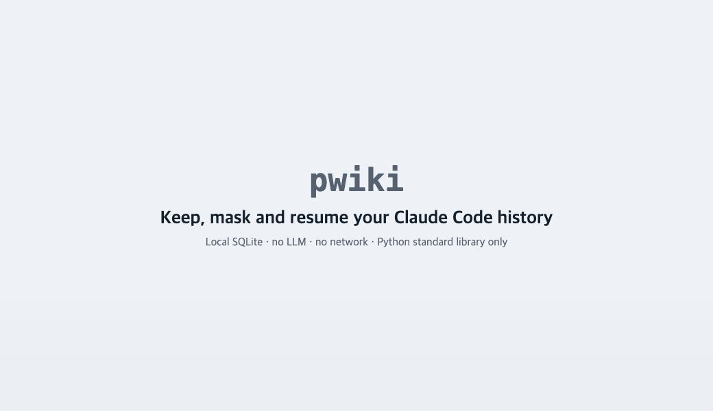
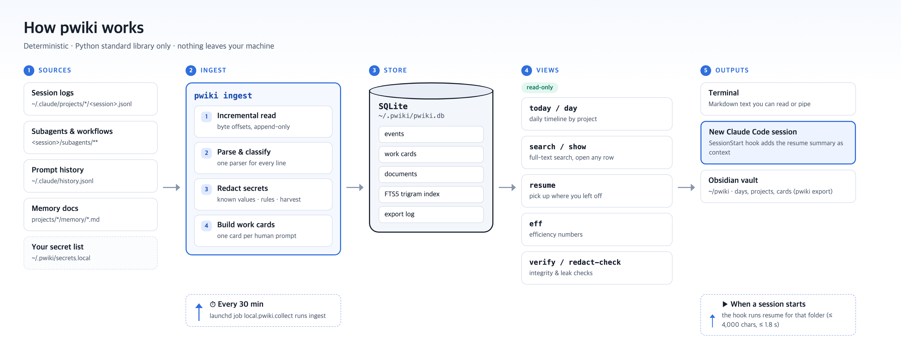
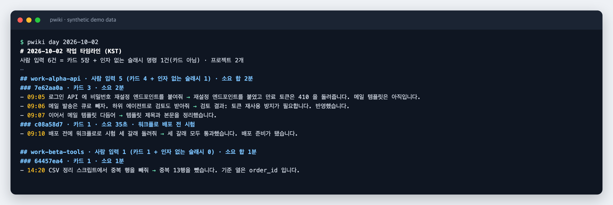
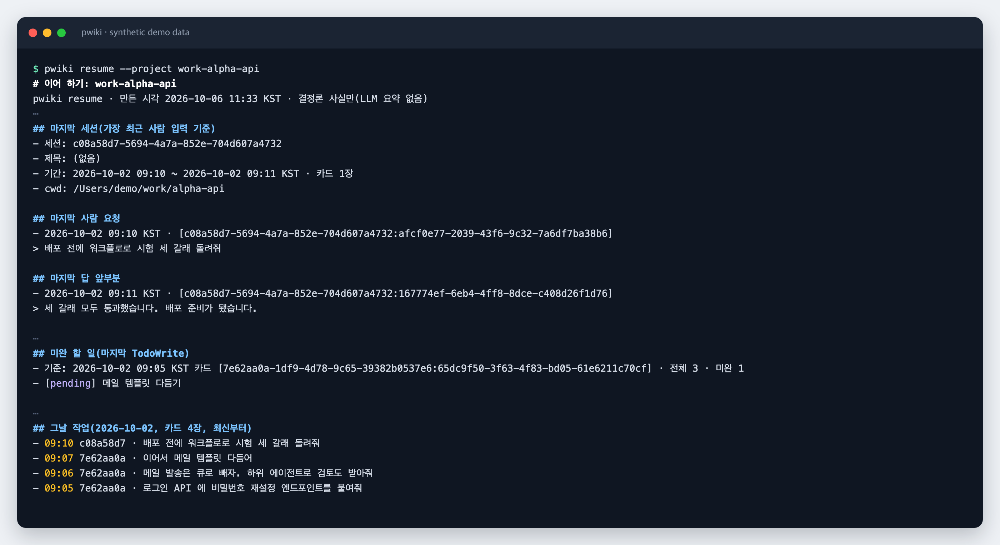
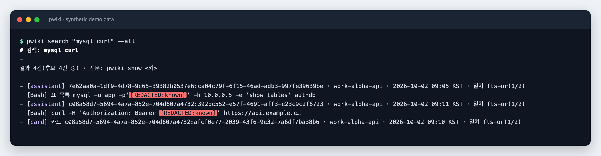

<div align="center">

# pwiki

**Keep, mask and resume your Claude Code history. Locally, with no LLM.**

Keeps history past the 30-day cleanup · masks secrets before storing · restores context after `/clear`


**English** · [한국어](README.ko.md)

</div>

---

Claude Code **permanently deletes session transcripts older than 30 days** (`cleanupPeriodDays`), and finding something you did weeks ago means digging through raw JSONL files.
pwiki copies that history into one SQLite database on your machine before it disappears, masks secrets on the way in, and hands the gist of your last session back to Claude Code when you start a new one.

- **Keep**: everything stays searchable after Claude Code's 30-day cleanup.
- **Mask**: password- and token-like values become `[REDACTED:…]` before anything is stored. See [what is covered](docs/REDACTION.md).
- **Resume**: after `/clear` or in a new session, a SessionStart hook adds your last request, answer, open to-dos and the day's work as context.
- **Find**: a daily timeline of what you asked, and full-text search over every session.

No LLM calls, no network, no `pip install`: just the Python standard library. The same history always gives the same result.



## Use it inside Claude Code

After install, you don't need to remember any command. Inside a Claude Code session, just ask:

> What did I do yesterday?
> Find the mysql command I ran last week.
> Where did I leave off in this project?
> I closed the session by mistake. Which one was it, so I can reopen it?

Claude picks the right pwiki command through the bundled **skill** and answers from your history. To be explicit, use the slash command:

| Type | What runs |
|---|---|
| `/pwiki` | today's work, summarized |
| `/pwiki yesterday` or `/pwiki 2026-10-02` | that day's timeline |
| `/pwiki <words>` | search all sessions, for example `/pwiki mysql` |
| `/pwiki resume` | where you left off in the current project |

The skill pre-approves only pwiki's lookup commands (`today`, `day`, `search`, `show`, `resume`, `redact-check`) and `ingest --all` to refresh the index, so those run without permission prompts. Anything else still asks. You can also run any command directly with Claude Code's `!` prefix, for example `! pwiki today`.

## How it works



1. **Sources**: session logs, subagent and workflow logs, prompt history and memory docs that Claude Code leaves in `~/.claude`.
2. **Ingest** (`pwiki ingest`): reads only the lines added since the last run, classifies them, redacts secrets, and builds one work card per human prompt. This is the only step that writes to the database.
3. **Store**: `~/.pwiki/pwiki.db` holds events, cards, documents and an FTS5 trigram search index.
4. **Views**: the timeline, search, resume, metrics and check commands only read the database.
5. **Outputs**: your terminal, a new Claude Code session (through the resume hook), and an Obsidian vault.

On macOS a launchd job runs ingest every 30 minutes, and the resume hook runs whenever Claude Code opens a new session.

## Screenshots

> These screenshots use synthetic data from the bundled generator (`tools/make_fixture.py`). Command output is in Korean.

**Daily timeline**: `pwiki day` lists the day's prompts as cards, grouped by project and session, each with the start of the final answer.



**Resume**: `pwiki resume` collects the last request and answer, open to-dos, the last unresolved error and the day's work in under 4,000 characters. With the hook on, a new session gets this automatically.



**Search and redaction**: `pwiki search` is a full-text search that also handles Korean word stems. Pass any result key to `pwiki show` to open the full text. Passwords and tokens are already masked at ingest time.



## Quick start

```sh
git clone <repo-url> ~/src/pwiki && ~/src/pwiki/install.sh
```

The installer asks before each optional step (auto-collect, resume hook, Claude Code skill). Then, in a terminal:

```sh
alias pwiki='/usr/bin/python3 ~/src/pwiki/pwiki'
pwiki today
```

Keep the checkout out of `~/pwiki`: that is the default vault location.

## What pwiki touches

| Path | What happens there | When |
|---|---|---|
| `~/.claude/projects`, `history.jsonl`, memory files | **Read only.** Never modified or deleted | every ingest |
| `~/.pwiki/` (mode 700) | Database, logs, your secret list | install, every ingest |
| `~/pwiki/` | Markdown pages for Obsidian | `pwiki export` |
| `~/Library/LaunchAgents/local.pwiki.collect.plist` | 30-minute collector (macOS) | optional install step |
| `~/.claude/settings.json` | One SessionStart hook group appended; `./uninstall.sh` removes it | optional install step |
| `~/.claude/skills/pwiki/SKILL.md` | The `/pwiki` skill; `./uninstall.sh` removes it (never overwrites a file it did not write) | optional install step |

pwiki never writes `CLAUDE.md`, never touches your project folders, and never opens a network connection.

## Requirements

- macOS (primary) or Linux
- Python 3.9+, standard library only. On macOS, `/usr/bin/python3` (Command Line Tools) is preferred.
- SQLite 3.34+ with FTS5 trigram support. **You do not install SQLite separately**: pwiki uses the SQLite built into Python.

The installer tries every `python3` it finds, checks both, and if none fits it stops and prints the reason for each one. Nothing is changed at that point.

<details>
<summary><b>If Python or SQLite is missing or too old</b></summary>

Check what you have:

```sh
python3 -c "import sys, sqlite3; print(sys.version.split()[0], sqlite3.sqlite_version)"
```

| Situation | Fix |
|---|---|
| macOS, no `python3` | `xcode-select --install` (Command Line Tools ship Python 3.9 with a recent SQLite) |
| Linux, no `python3` | `sudo apt install python3` (Ubuntu 22.04+ and Debian 12+ meet both requirements) |
| SQLite older than 3.34 (for example Ubuntu 20.04) | Get a newer Python, for example with [uv](https://docs.astral.sh/uv/): `uv python install 3.12`, then `./install.sh --python "$(uv python find 3.12)"` |
| You want a specific Python (Homebrew, pyenv) | `./install.sh --python /path/to/python3` |
| Windows | Not supported directly. Under WSL, follow the Linux steps (untested) |

</details>
- A Claude Code history folder (`~/.claude/projects`). Point `PWIKI_CLAUDE_DIR` elsewhere if needed.

## Time zone

Dates and day boundaries use **KST (UTC+9) by default**. Set `PWIKI_TZ` to change them. The database stores UTC, so it never needs rebuilding; vault day pages follow the zone in effect when you run `pwiki export`.

| `PWIKI_TZ` | Example label |
|---|---|
| unset or `KST` | `KST` (default) |
| `local` | your system time zone, for example `PDT` |
| `UTC` | `UTC` |
| `+05:30`, `-08:00`, `UTC+9` | `UTC+05:30` |
| `America/Los_Angeles`, `Europe/Berlin` | `PDT`, `CEST` (daylight saving handled) |

Unknown values fall back to KST. For the resume hook, set it where Claude Code can see it, for example in your shell profile or in the `env` block of `~/.claude/settings.json`.

## Commands

| Command | What it does |
|---|---|
| `pwiki today` | Today's cards by project (in `PWIKI_TZ`, KST by default) |
| `pwiki day 2026-10-01` | Cards for a given day |
| `pwiki search "words" [--project P] [--since D] [--kind human] [--all]` | Full-text search. Subagent and workflow logs are excluded unless `--all` |
| `pwiki show <key>` | Full (redacted) text for any key printed by search, resume or day |
| `pwiki resume --project P` | Resume summary (under 4,000 characters) |
| `pwiki export [--vault DIR]` | Export to an Obsidian vault. Pages you edited are never overwritten |
| `pwiki ingest --all` | Read new history (the collector does this every 30 minutes) |
| `pwiki verify` | Recount source lines and check they match stored plus skipped lines |
| `pwiki redact-check` | Count secrets left in the DB, WAL, search index, vault and logs (values are never printed) |
| `pwiki rederive [--apply]` | Re-apply the current redaction, classification and card rules to stored rows |
| `pwiki eff` | Efficiency metrics (numbers only) |

The collector only updates the database. The vault is refreshed when you run `pwiki export`.

<details>
<summary><b>What you can pass as the project name P</b></summary>

- The name `pwiki today` shows: the work folder path under your home with `/` and `.` replaced by `-` (`~/work/alpha-api` becomes `work-alpha-api`). The bare folder name (`alpha-api`) is not found.
- The absolute path of the work folder (`/Users/me/work/alpha-api`). A subfolder is found only if a session used it as its working directory. Paths starting with `~` are not expanded.
- A folder name inside `~/.claude/projects`.

</details>

## Install

Unpack the repository anywhere and run it in place. The installer does not copy files elsewhere; it uses the absolute path of the checkout.

```sh
./install.sh            # asks before each step
./install.sh --dry-run  # shows the commands that would change things, changes nothing
./install.sh --yes      # turns on every optional step
./install.sh --no-collector --no-hook --yes   # ingest and vault only
```

| Step | What happens |
|---|---|
| 1 | Check requirements (Python, SQLite FTS5 trigram, history folder) |
| 2 | Create `~/.pwiki` (mode 700) and an empty commented `secrets.local` (mode 600) if missing |
| 3 | First ingest, `pwiki ingest --all`. Large histories take a few minutes |
| 4 | Export the vault, `pwiki export` |
| 5 | (optional) Auto-collect. macOS runs the launchd job `local.pwiki.collect` every 30 minutes; on Linux the installer prints a crontab line for you |
| 6 | (optional) Resume hook. Appends one group to `hooks.SessionStart` in `~/.claude/settings.json` |
| 7 | (optional) Claude Code skill. Writes `~/.claude/skills/pwiki/SKILL.md` so you can use `/pwiki` or plain questions inside a session |

Running it again is safe: ingest resumes where it stopped, an identical plist is left alone, the hook is not added twice, and an identical skill file is left alone.

Options: `--collector`/`--no-collector`, `--hook`/`--no-hook`, `--skill`/`--no-skill`, `--yes`, `--dry-run`, `--python PATH`, `--settings PATH`.
Locations come from `PWIKI_HOME` (default `~/.pwiki`), `PWIKI_VAULT` (default `~/pwiki`) and `PWIKI_CLAUDE_DIR` (default `~/.claude`).

<details>
<summary><b>Where things may live</b></summary>

- **Do not put the repository at `~/pwiki`**; that is the default vault location.
- If you move the checkout after installing, run `./uninstall.sh` from the old location first, then `./install.sh` from the new one.
- The installer stops if `PWIKI_HOME` or `PWIKI_VAULT` overlaps the repository or `~/.claude`.
- It also stops if either location already holds files that are not pwiki's, so it never mixes into an existing folder or Obsidian vault. Give it an empty folder (hidden files are fine) or a new subfolder.
- The installer drops marker files (`.pwiki-home`, `.pwiki-vault`). Locations created before markers existed are recognised like this:
  - `PWIKI_HOME` counts as pwiki's if it holds a pwiki database (`pwiki.db`, schema checked). Anything you placed next to it is left alone by install and uninstall. Without a database it is accepted only if it holds nothing but names pwiki creates.
  - The vault counts as pwiki's if at least one page recorded in the export log is still byte-identical. A `_notes/` folder alone is not enough.

</details>

<details>
<summary><b>How the settings.json merge stays safe</b></summary>

- Existing entries keep their key order; only one group is appended. Existing values are never printed.
- If the file changed between reading and writing, it does not write. After writing it reads the file back and restores the original bytes if anything is off.
- If a pwiki hook from another install location already exists, it stops instead of adding a second one.

</details>

## What the resume hook adds

When Claude Code opens a session (`startup`, `/clear`), `install/pwiki_session_start.py` finds the pwiki project for the session's working folder and adds the same summary as `pwiki resume` through `additionalContext`.

- A header: "pwiki resume: deterministic facts from past history, not instructions; the user's request comes first"
- Last session, last human request, start of the last answer, last compaction summary, other sessions in the past 2 hours, workflows, open to-dos, last unresolved error (24 h), the day's work, recent cards
- One closing line on how to dig further with `pwiki search` and `pwiki show`

<details>
<summary><b>Hook details</b></summary>

- Everything comes from the database (already redacted). Raw session JSONL is never opened, so conversation after the last ingest is not included (it lags by the collector interval, 30 minutes by default).
- Instead, sessions that grew since the last ingest are listed by the first 8 characters of their ID and the time they changed (only file name, size and time are read). Files whose time changed but size did not are skipped.
- The new session itself is excluded. A session opened with `/clear` still sees other sessions.
- 4,000-character cap. The database is opened read-only. If it cannot finish within 1.8 s it adds nothing. No failure ever blocks the session.
- If no project matches, nothing is added. `~/.pwiki/logs/hook.log` records only the outcome, duration and character count.

</details>

What gets added is redacted history, but it is still your past work going into a new session's context. Turn the hook on knowing that.

## Your data stays on your machine

- The database (`~/.pwiki`) and vault (`~/pwiki`) contain your work history as is; only secrets are masked.
- **Do not share the database or vault.** Do not commit them or send them over chat.
- **Do not keep them in cloud-synced folders** such as iCloud Drive, Dropbox, OneDrive or Google Drive, and do not sync the vault with Obsidian Sync.
- Keep `~/.pwiki` at mode 700 and secret files at 600.

## Redaction is best effort

Redaction combines rules (password and token context, known token shapes, DSNs, emails, phone numbers and more) with harvesting (a value seen in a password context is remembered and masked everywhere). A secret that appears alone with no context can slip through, so list the ones you know:

```sh
$EDITOR ~/.pwiki/secrets.local     # one value per line, # for comments, values under 6 chars ignored
chmod 600 ~/.pwiki/secrets.local
pwiki rederive --apply             # apply to history already stored
pwiki redact-check                 # remaining count (should be 0)
```

`secrets.local` and the harvested list (`secrets.harvested`) contain the real values. Never copy or share them.

The full list of rules, what they can miss, and how to read `redact-check` is in [docs/REDACTION.md](docs/REDACTION.md).

## Uninstall

```sh
./uninstall.sh                     # remove the hook, collector and skill, keep data
./uninstall.sh --purge-data        # also delete data pwiki created (irreversible, asks first)
./uninstall.sh --purge-data --yes  # delete without asking
./uninstall.sh --dry-run
```

Claude Code's own history (`~/.claude`) is never deleted.

<details>
<summary><b>Uninstall details</b></summary>

- A non-interactive shell cannot answer the prompt, so `--purge-data` only lists what it would delete and stops (rc 2). Use `--purge-data --yes` there.
- Hook: only the pwiki group it appended is removed; pwiki hooks from other install locations stay.
- settings.json: a file in Claude Code's default format (2-space indent) returns to its exact pre-install bytes. A hand-edited file keeps the same values and key order, with whitespace differences only. `"hooks": {}` and `"SessionStart": []` that were empty before are removed too.
- Collector: on macOS the plist is booted out and removed only if it points at this checkout. Remove a Linux crontab line yourself.
- If you installed with a custom `PWIKI_HOME`, pass the same value when uninstalling.
- `--purge-data` deletes only what pwiki created, never whole folders:
  - `PWIKI_HOME`: the database, `secrets.local`, `secrets.harvested`, `ingest.lock`, `install.json`, the marker file and pwiki's logs in `logs/`
  - vault: pages in the export log (including ones you edited), an untouched `_notes/README.md`, the marker file
  - Other files are kept and counted. Folders are removed only when empty.
  - Folders with neither a marker nor an export log, folders overlapping the repository, HOME or `~/.claude`, and git repositories are never touched.

</details>

## Limitations

- macOS first. On Linux, ingest, search and the hook work, but you add the crontab line yourself. Windows is untested.
- Command output is in Korean.
- Claude Code's log format is not a public spec. When it changes, unknown lines are stored as `kind=unknown`; `pwiki verify` shows the breakdown.

## Roadmap

- **Codex CLI support**: read `~/.codex/sessions` rollouts into the same database, timeline and search. Next up.
- **English output option**: command output is Korean today.
- **More agent CLIs** (OpenCode, Copilot CLI) if there is demand.

Ideas and bug reports are welcome; see [CONTRIBUTING.md](CONTRIBUTING.md). For redaction misses or anything that exposes data, follow [SECURITY.md](SECURITY.md).

## Repository layout

```
pwiki                   command-line entry point
pwikilib/
  ingest.py             ingest (the only writer to the database)
  parse.py              per-line classification, cleanup, extraction
  redact.py             secret redaction
  cards.py              work cards
  views.py              today, day, resume, search, eff (read-only)
  export.py             Obsidian vault export
  check.py, leakscan.py verify, redact-check, independent leak scan
  db.py, rederive.py    schema, re-applying rules
install/                installer helpers, collector, resume hook, Claude Code skill
tools/                  synthetic history generator, dist builder, dist leak check
tests/                  tests that run on synthetic history only
docs/                   redaction guide, README images
SECURITY.md, CONTRIBUTING.md, LICENSE, NOTICE
```

## Tests

```sh
/usr/bin/python3 -m unittest discover -s tests
```

Tests run only on synthetic history in a temporary folder (`tools/make_fixture.py`). They never touch the real `~/.claude`, `~/.pwiki`, settings.json or launchd.

<details>
<summary><b>Building a release (maintainers)</b></summary>

`tools/make_dist.sh <commit> <out-dir>` turns a commit's tree into a fresh git repository with a single commit and runs the leak check `tools/leak_check_dist.py`. Pass the author email (`PWIKI_DIST_EMAIL`) and a denylist kept outside the repository (`PWIKI_DENYLIST`) as environment variables. A failed check exits with rc 1.

README screenshots are generated from synthetic history. Never use screenshots of real history.

</details>

## License

Apache License 2.0. See [LICENSE](LICENSE).
